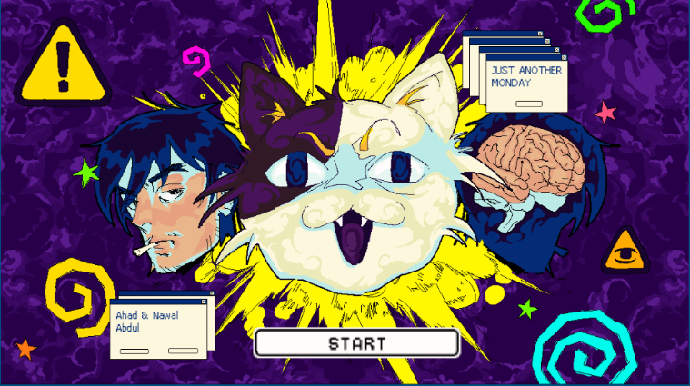
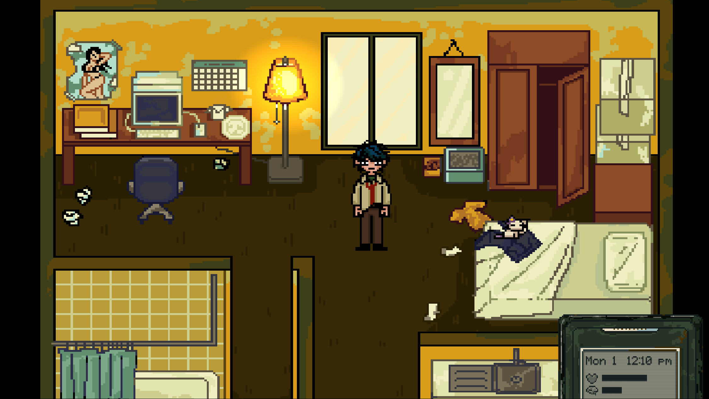
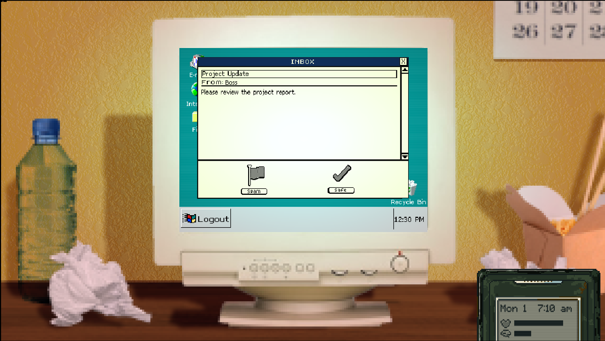
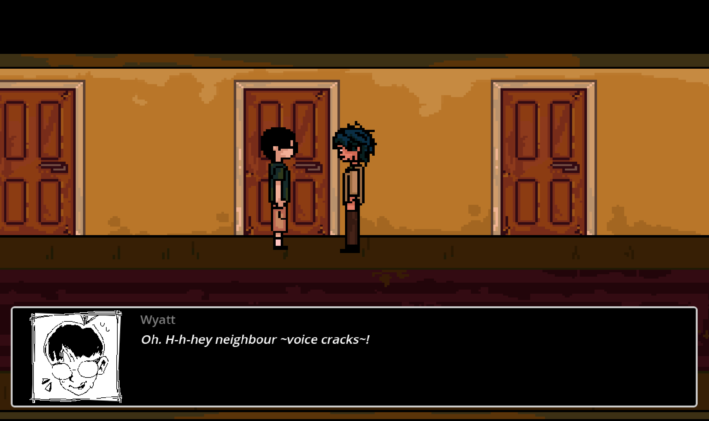
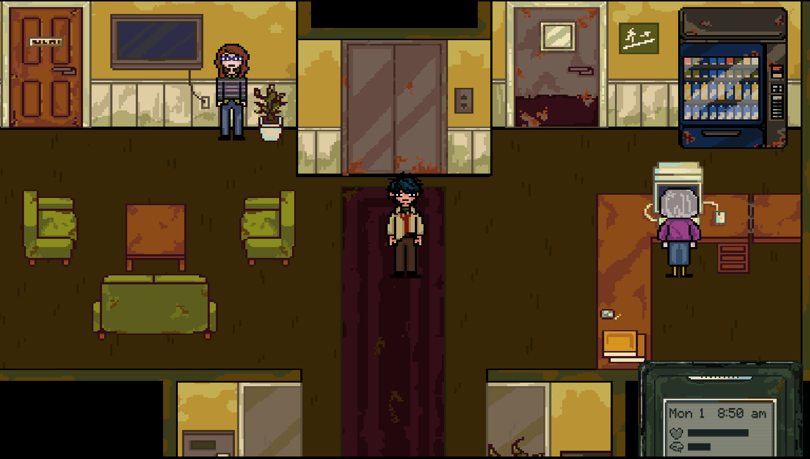
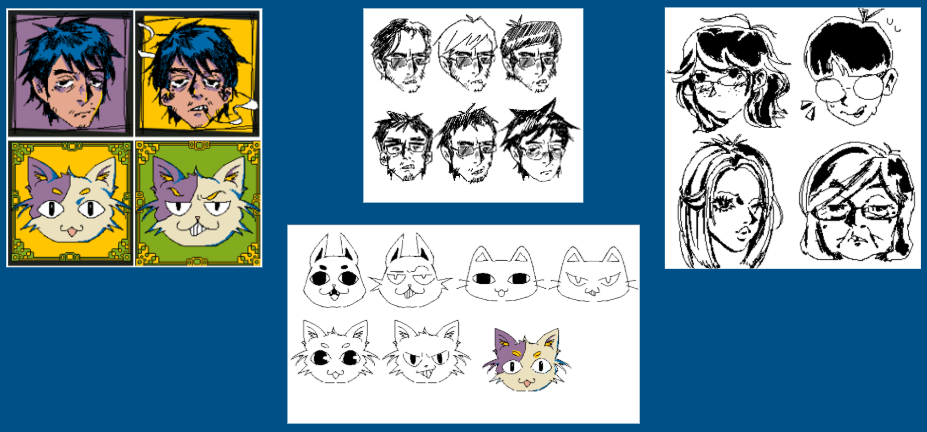

# Just Another Monday

*A psychological narrative RPG about routine, resistance, and reality breaking down.*

---

## Summary of Mechanics

**Just Another Monday** is a psychological RPG built in **Godot 4.3** that revolves around **dialogue**, **interactions**, **stat management**, and **story progression** tied to **routine and deviation**.

Players manage two main stats:

- **Stamina** – depleted by daily activity and stress relief actions
- **Stress** – influenced by choices, avoidance, and sanity-based triggers

Gameplay centers around:

- Performing mundane tasks (emails, hygiene, eating)
- Talking with NPCs using branching dialogue trees
- Navigating a world that subtly breaks as your decisions pile up
- Interacting with a **phone UI** that tracks in-game time and (soon) quest data

The intended structure follows a **four-week in-game cycle**, where narrative developments and gameplay restrictions evolve week by week.

The game includes a few **mixed-media minigames** (e.g. spam-sorting, chores), these are still in development.

---

## Game Dynamics

At the heart of the game is a dynamic feedback loop between **player actions, stats, and the environment**.

Key mechanics:

- **Every action has a cost or benefit** to Stamina or Stress
  - Smoking might relieve Stress, but lowers Stamina
  - Completing routine tasks may restore Stamina, but increase Stress
- **Cumulative effects**: Choices ripple outward across the in-game week
  - NPC behavior, scene dialogue, and environment tone can shift based on previous decisions
- **Glitch mechanics** (early stage): At high Stress, reality begins to distort
  - Dialogue becomes corrupted
  - UI malfunctions
  - World transitions into surreal territory

Eventually, even **routine actions** may become **emotionally or mechanically distorted**, reflecting the protagonist's deteriorating grip on reality.

---

## Aesthetics

Core elements:

- **Pixel-art environments** with muted, liminal tones
- **Hand-drawn character portraits** that shift expression based on emotional state
- **Color grading** and lighting that change with sanity
- **Abstract, surreal breakdowns** as stress escalates (e.g. visual noise, glitch overlays)

The story begins with **existential discontent** and escalates into **surreal psychological horror**. Inspired by *Vewn*, *Evangelion*, and *Plastic Beach*, the aesthetic builds a world that reflects the protagonist's internal collapse.

---

## Tech Stack

- **Engine**: [Godot 4.3](https://godotengine.org/)

- **Plugins**:
  - [Nathan Hoad’s Dialogue Manager 3](https://github.com/nathanhoad/godot_dialogue_manager)
  - [Phantom Camera](https://github.com/ramokz/phantom-camera)
---

## Development Status

This project is a work-in-progress prototype. Several systems are functional in a vertical slice form, including:

- Basic **morning routine gameplay**
- NPC **dialogue interactions**
- Phone **time display** with future expansion planned
- **Stat system** (Stamina & Stress) with partial effects
- Early versions of **glitch mechanics** and narrative branching

However, much of the larger story structure, weekly progression, and visual/audio polish are **still in development**.
---

## Gallery

  
  
  

  
  
  

